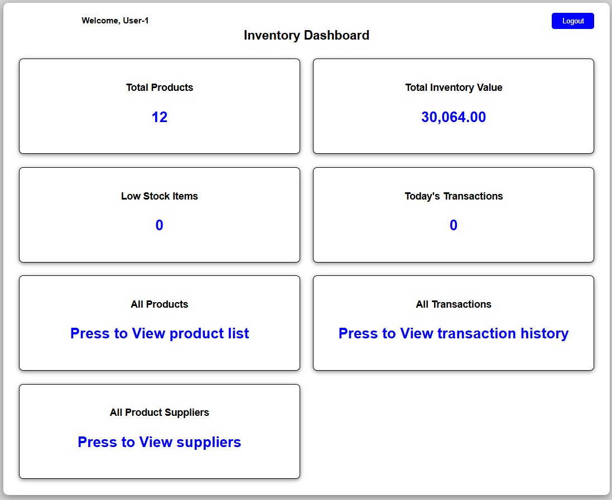
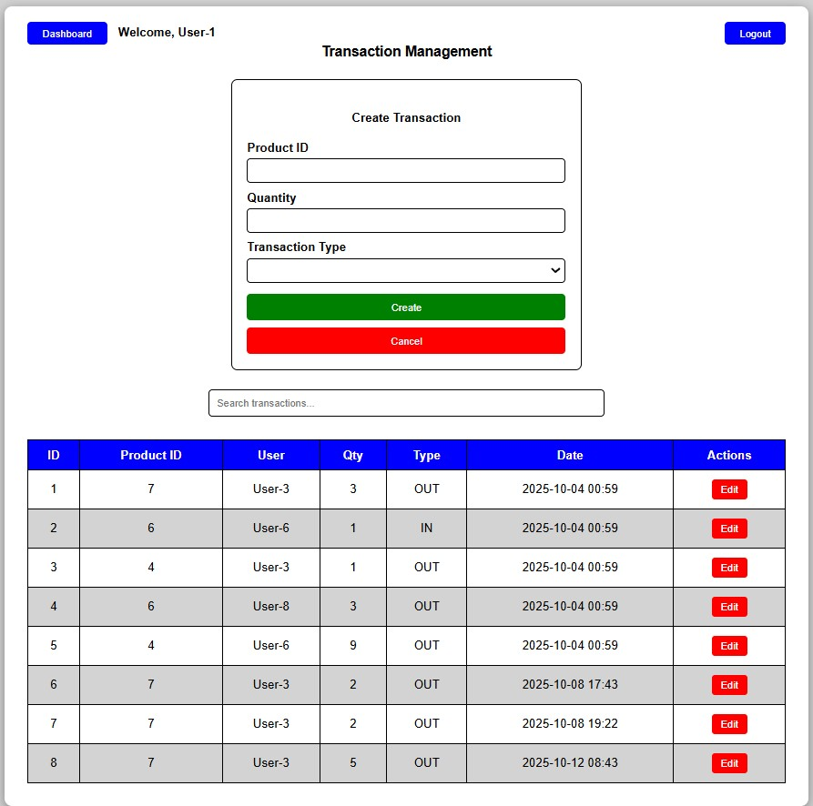
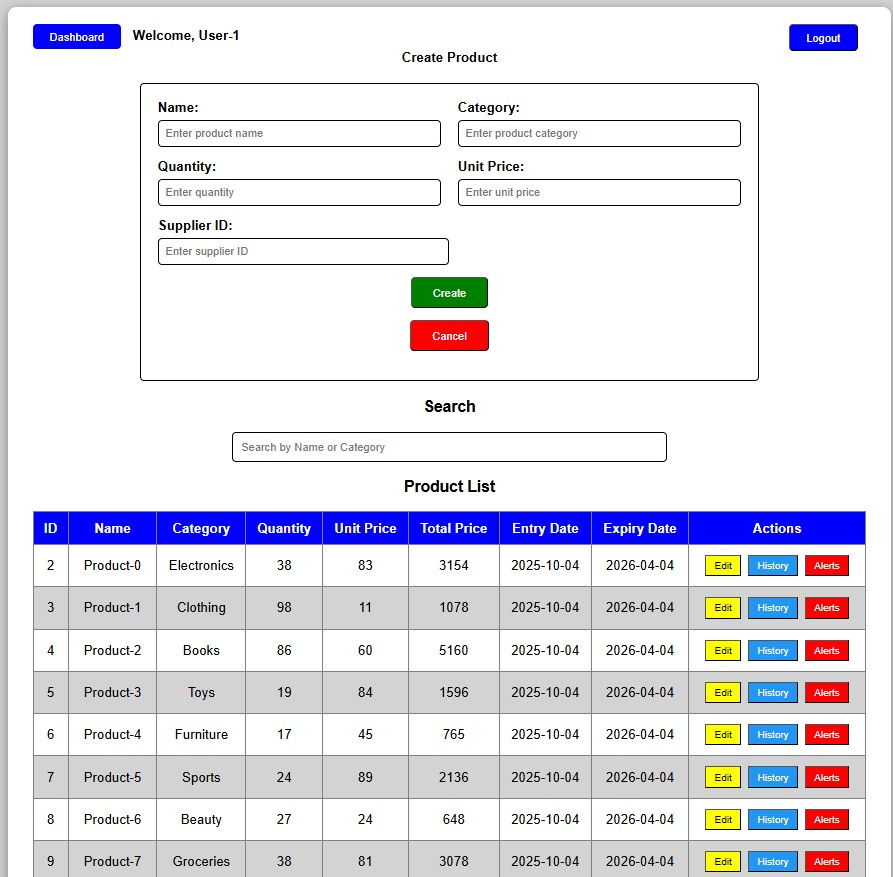
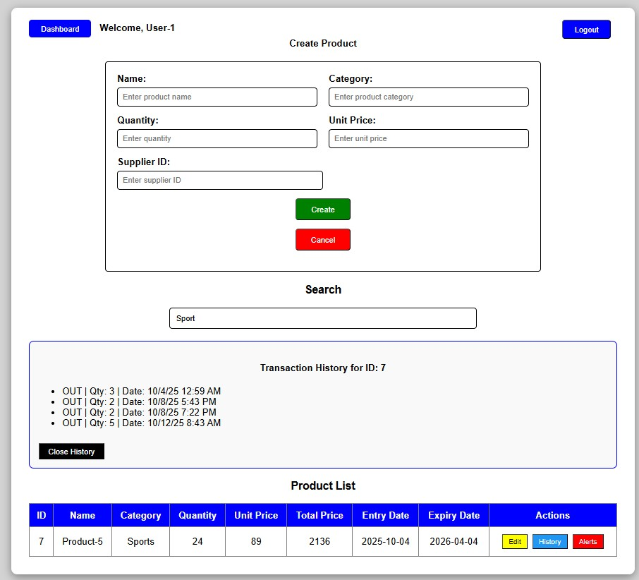
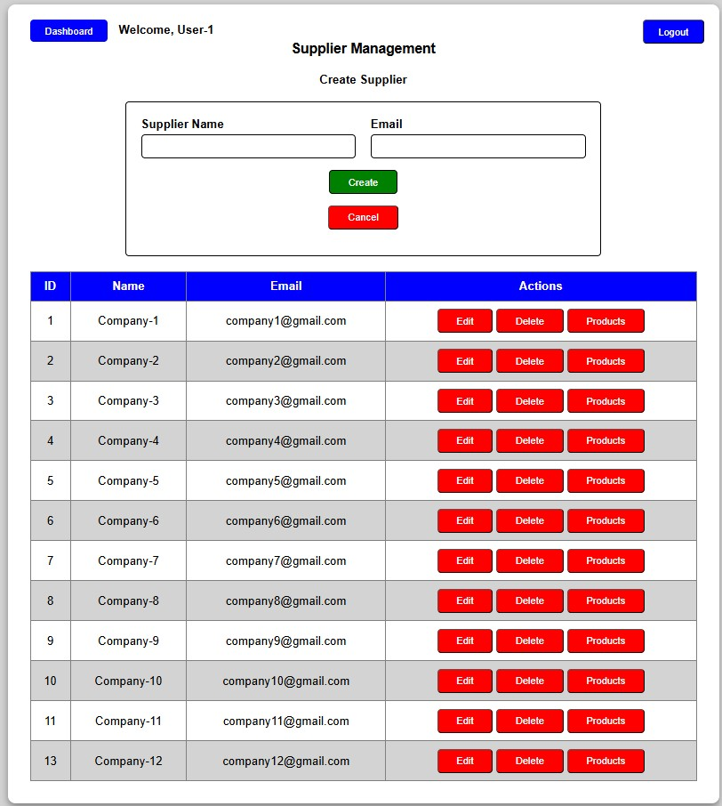
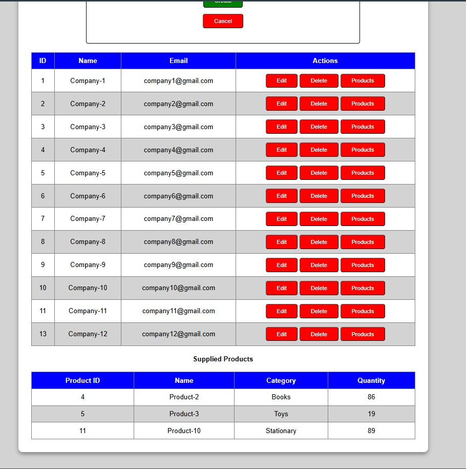
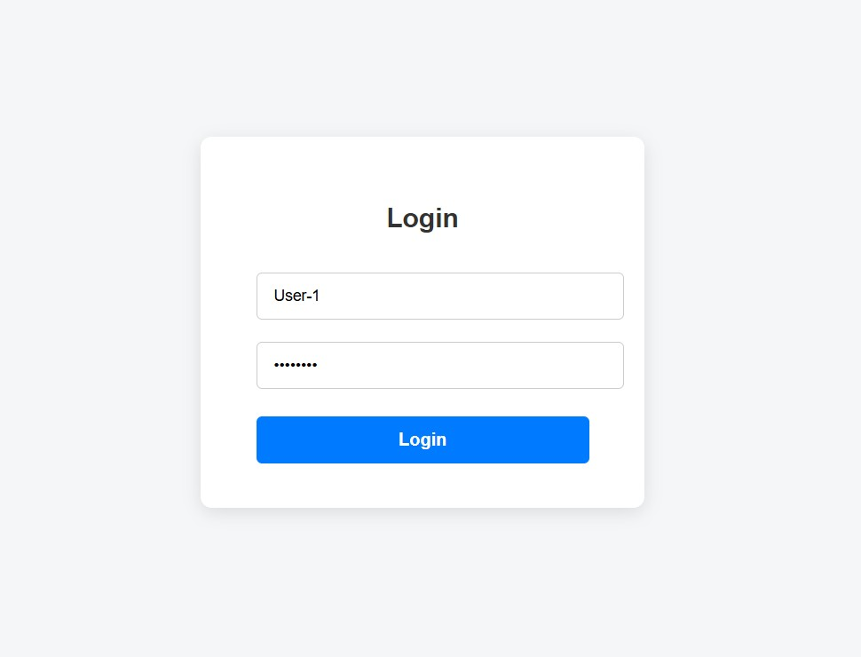

# Inventory Management System

A professional, full-stack Inventory Management solution built with a Decoupled 3-Tier Architecture.
This system enables businesses to manage products and suppliers while maintaining a secure, audited history of all stock movements.

## Key Features
* Executive Dashboard: Real-time data visualization of Total Inventory Value, Product counts, and automated Low Stock Alerts (Items < 10 units).
* Transaction Ledger: A robust "Stock Ledger" system tracking every IN and OUT movement, timestamped and linked to the active user.
* On-Demand PDF Reporting: Instant generation of PDF reports using jsPDF. Supports exporting the full history or a Product-Specific Ledger for auditing.
* JWT Security: Secure authentication using JSON Web Tokens with a Silent Refresh mechanism (Access + Refresh tokens) to ensure zero session interruption.
* Role-Based Access Control (RBAC): Granular permissions where sensitive actions (like Deleting transactions or products) are restricted to the Admin role.

## Technology Stack
### Backend (.NET Web API)
* Framework: ASP.NET Web API 2
* Architecture: 3-Layer Pattern (DAL, BLL, Web API)
* ORM: Entity Framework 6 (Code First)
* Database: Microsoft SQL Server
* Mapping: AutoMapper (for DTO to Entity conversion)
* Security: JWT (JSON Web Tokens) & Refresh Tokens

### Frontend (AngularJS)
* Framework: AngularJS 1.6
* Design: Custom CSS (Grid & Flexbox)
* HTTP Logic: Interceptors for automatic header injection and 401 error handling.

## Technical Architecture
 This project follows the SOLID design principles to ensure a clean and robust codebase
1. DAL (Data Access Layer): Uses the Repository Pattern to abstract database operations. It contains the Entity Framework DbContext and Migrations.
2. BLL (Business Logic Layer): Contains the "Business Intelligence." It processes data, handles DTO mappings, and calculates dashboard statistics.
3. Web API Layer: Exposes RESTful endpoints. It handles the HTTP request/response lifecycle and implements security filters.
4. Frontend Layer: A Single Page Application (SPA) that consumes the API and manages user state.
   
## Authentication & Security Logic
The system utilizes an advanced JWT Refresh Mechanism:
* Access Token: A short-lived token (e.g., 30 mins) sent in the Authorization header.
* Refresh Token: A long-lived token stored in localStorage used to request a new Access Token.
* The Interceptor: If an API call returns a 401 Unauthorized, the AngularJS interceptor automatically:
   1. Pauses the request.
   2. Calls the /Refresh endpoint to get a new token.
   3. Retries the original request with the new token.
   4. Logs the user out only if the Refresh Token is also expired.

## 📸 Project Preview

### Dashboard

### Transaction 

### Product

### Product history notification

### Suppliers

### Supplier with Product

### Login

